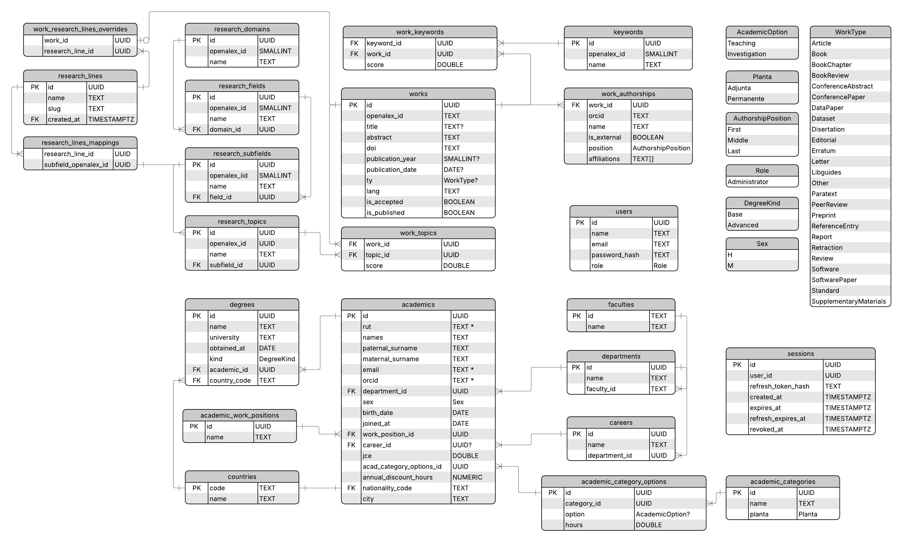

# Plataforma de Visualización y Gestión de Investigación

Plataforma web para importar, clasificar y analizar la producción científica de la Facultad de Ingeniería de la UCT, reemplazando la gestión en planillas Excel.

## Features

| Área | Capacidad |
|------|-----------|
| Académicos | Registro centralizado con validaciones (RUT, ORCID, JCE) |
| Publicaciones | Sincronización desde ORCID + OpenAlex (individual/masiva) |
| Clasificación | Líneas de investigación propias sobre taxonomía OpenAlex |
| Indexación | Detección de revistas WoS y Scopus por ISSN |
| Estadísticas | Dashboards por facultad, departamento, línea y académico |
| Colaboración | Grafo de coautorías y recomendación de colaboradores |

## Taxonomía

Clasificación por jerarquía OpenAlex, mapeada a líneas de investigación institucionales: `dominio → campo → subcampo → tópico → palabra clave`.

**Líneas de investigación:** Materiales Avanzados y Bioproductos · Ciencias de la Tierra · Sostenibilidad · IA, Sistemas Complejos y Modelamiento Matemático · Educación en Ingeniería · Sin Asignar

La asignación a una línea es automática (override manual > tópico de mayor relevancia > "Sin Asignar").

## Stack

| Capa | Tecnología |
|------|------------|
| Servidor | Rust, Sword, sqlx |
| Cliente | SvelteKit + Tailwind v4, TanStack Query |
| BD | PostgreSQL |
| Infra | Docker Compose (server, client, postgres, nginx), GitHub Actions |

## Comandos

```bash
make run        # docker compose up
make lint       # cargo clippy + pnpm lint + check
make fmt        # cargo fmt + pnpm format
make migration name=x  # nueva migración sqlx
```

## ERD


